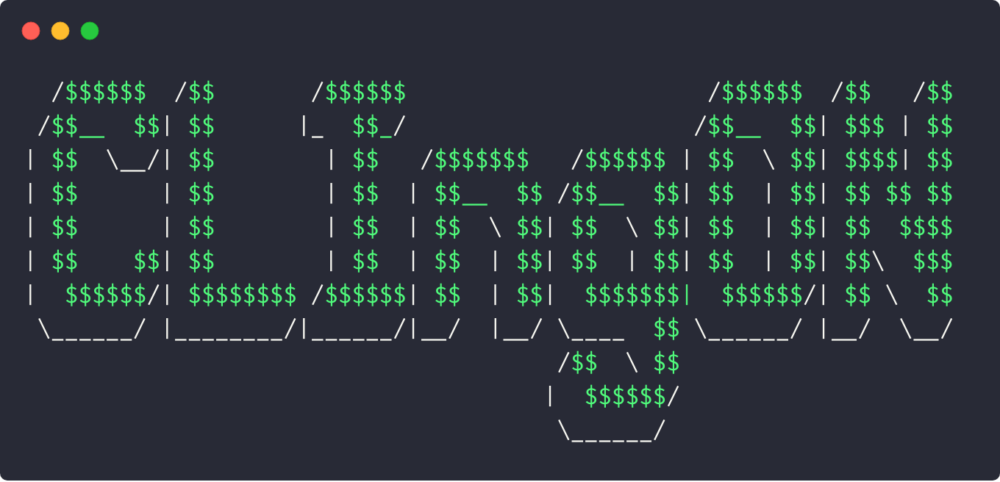

<div style="padding-left:5px; width:300px; margin:auto;">

</div>

---

**CLIngON** allows you to scaffold frontmatter and/or other metadata into your [`mdx`](https://mdxjs.com) files.

[](https://oclif.io)
[](https://npmjs.org/package/clingon-cli)
[](https://npmjs.org/package/clingon-cli)
[](https://github.com/rajinwonderland/clingon-cli/blob/master/package.json)

# TOC
<!-- toc -->
* [TOC](#toc)
* [Usage](#usage)
* [Commands](#commands)
* [Example Output](#example-output)
<!-- tocstop -->
# Usage
<!-- usage -->
```sh-session
$ npm install -g clingon-cli
$ clingon COMMAND
running command...
$ clingon (-v|--version|version)
clingon-cli/0.0.4 darwin-x64 node-v10.13.0
$ clingon --help [COMMAND]
USAGE
  $ clingon COMMAND
...
```
<!-- usagestop -->
# Commands
<!-- commands -->
* [`clingon convert`](#clingon-convert)
* [`clingon create`](#clingon-create)
* [`clingon help [COMMAND]`](#clingon-help-command)
* [`clingon list`](#clingon-list)

## `clingon convert`

Convert a medium url into plain old markdown 😎

```
USAGE
  $ clingon convert

OPTIONS
  -h, --help           show CLI help

  -o, --output=output  The desired destination for the parsed markdown (e.g. path/to/content/index.mdx) or copy to copy
                       the markdown
```

_See code: [src/commands/convert.ts](https://github.com/rajinwonderland/clingon-cli/blob/v0.0.4/src/commands/convert.ts)_

## `clingon create`

Scaffold metadata or frontmatter for your mdx or md content

```
USAGE
  $ clingon create

OPTIONS
  -h, --help           show CLI help
  -o, --output=output  The desired output file for the scaffolded metadata

EXAMPLES
  $ clingon create
  clingon create -p=/path/to/content
  clingon create -e=mdx
```

_See code: [src/commands/create.ts](https://github.com/rajinwonderland/clingon-cli/blob/v0.0.4/src/commands/create.ts)_

## `clingon help [COMMAND]`

display help for clingon

```
USAGE
  $ clingon help [COMMAND]

ARGUMENTS
  COMMAND  command to show help for

OPTIONS
  --all  see all commands in CLI
```

_See code: [@oclif/plugin-help](https://github.com/oclif/plugin-help/blob/v2.1.6/src/commands/help.ts)_

## `clingon list`

describe the command here

```
USAGE
  $ clingon list

OPTIONS
  -h, --help  show CLI help
```

_See code: [src/commands/list.ts](https://github.com/rajinwonderland/clingon-cli/blob/v0.0.4/src/commands/list.ts)_
<!-- commandsstop -->


# Example Output

For now, the [CLIngON](https://npmjs.com/clingon-cli) cli generates the following frontmatter output which is consistent to what we use over at [novvum](https://novvum.io) for our blog which is using [gatsbyjs](https://gatsbyjs.org) and [mdx](https://mdxjs.com)

```javascript

export const frontmatter = {
  title: 'TITLE'
  date: '2019-05-14T10:00:00.200Z', // In ISO format
  author: "author's name"
  bio: 'some bio here...'
  twitter: 'twittter-handle',
  github: 'github-handle',
  piclink: 'avatar-link', // Url the author's avatar
  banner: 'image-link', // Url to a banner image
  layout: 'default', // Different keys for generating alternative blog layoutts
  tags: ['tag'] // Tags relevant to the article

}

```
Here's the [`typescript`](http://www.typescriptlang.org/) interface it's using

```typescript
export type FrontMatterOptions = {
  title: string;
  date: Date; // In ISO format
  author: string;
  bio: string;
  twitter?: string;
  github?: string;
  piclink: string;
  banner: string;
  layout: LayoutOptions;
  tags: string[];
};

export enum LayoutOptions {
  'alt',
  'default'
}

```

The `clingon create blog` command also will take the title you input and automatically slug it like so

| Input                     | Context                                  | Slug                                     | File                                                               |
| ------------------------- | ---------------------------------------- | ---------------------------------------- | ------------------------------------------------------------------ |
| title: "My Article Title" | _File with the same name does not exist_ | `my-article-title`                       | `path/to/content/my-article-title/index.mdx`                       |
| title: "I am Ironman"     | _File with the same name exists_         | `i-am-ironman-cjvpxcrh8000001msf9pfeayq` | `path/to/content/i-am-ironman-cjvpxcrh8000001msf9pfeayq/index.mdx` |

> Note if a file path with the same directory already exists, a new directory will be created with a collision-resistant id ([`cuid`](https://www.npmjs.com/package/cuid)) hashed at the end to avoid any overwriting issues.
